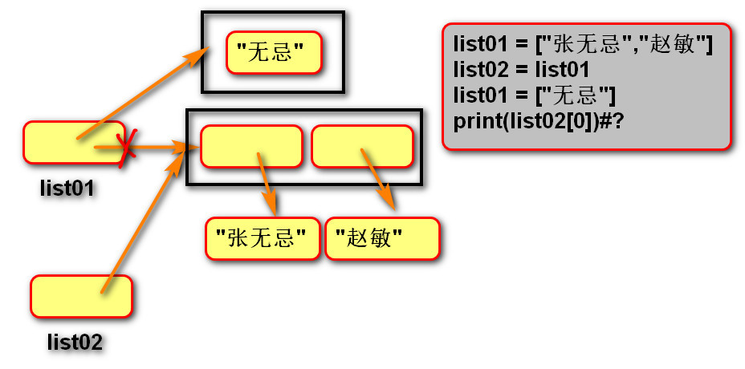
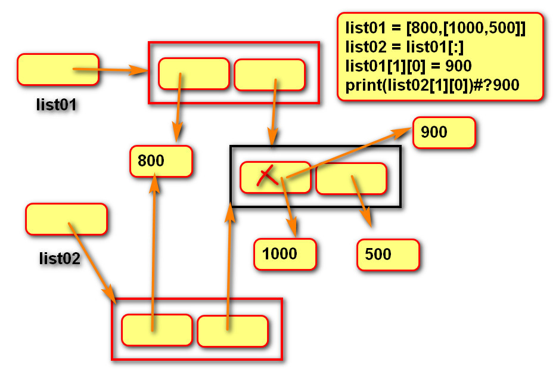

[TOC]
## 复制
### 浅复制
>浅复制：只复制一层

>list1 = list2[:]

>list1 = list2.copy()

```
for index in range(0,len(list2)):
        list1[i] = list2[i]
```

>浅复制内存图1:

>浅复制内存图2:

>浅复制内存图3:


### 深复制
>深复制：复制所有层
```
import copy
list1 = copy.deepcopy(list2)
```
>深复制内存图:

