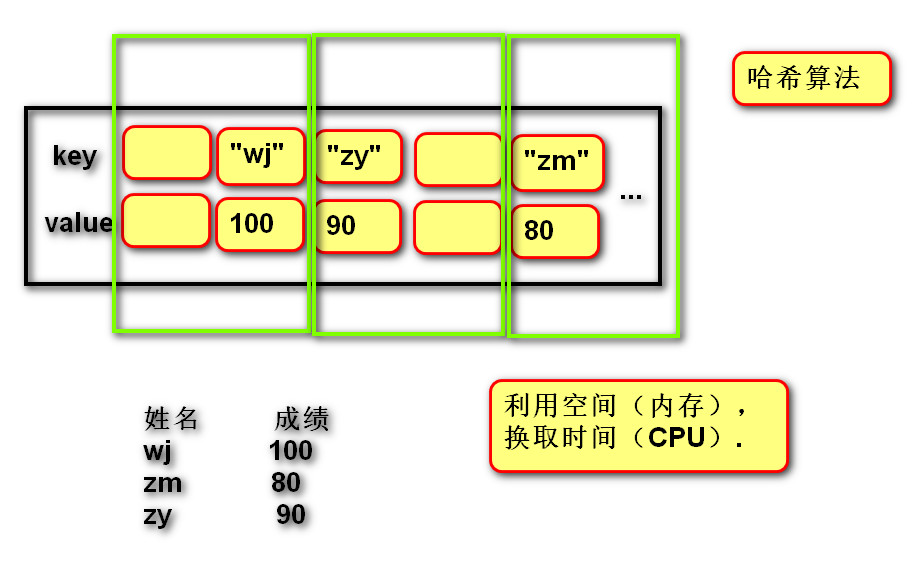

[TOC]
## 字典
### 1.创建 空字典
```
dict01 = {}
dict01 = dict()
# 创建有默认值的字典
dict01 = {"wj":100,"zm":80,"zr":90}
dict01 = dict([("a","b"),("c","d")])
print(dict01) # {'a': 'b', 'c': 'd'}
```
>字典内存图


### 2.查找元素
```
#根据key查找value
print(dict01["a"])
# 如果ｋｅｙ不存在，查找时会错误.
if "qtx" in dict01:# 如果存在key
    print(dict01["qtx"])
```

### 3.修改元素
>之前存在key的时候从可以修改
dict01["a"] = "BB"

### 4.添加
>之前不存在key就可以添加,如果之前存在就变成修改了
dict01["e"] = "f"

### 5.删除
```
del dict01["a"]
print(dict01)
```

### 6.遍历
>遍历:获取字典中所有元素
```
#遍历字典，获取key
for key in dict01:
    print(key)
    print(dict01[key])

# 遍历字典，获取value
for value in dict01.values():
    print(value)

# 遍历字典，获取键值对key value(元组).
for item in dict01.items():
    print(item[0])
    print(item[1])

for k,v in dict01.items():
    print(k)
    print(v)
```