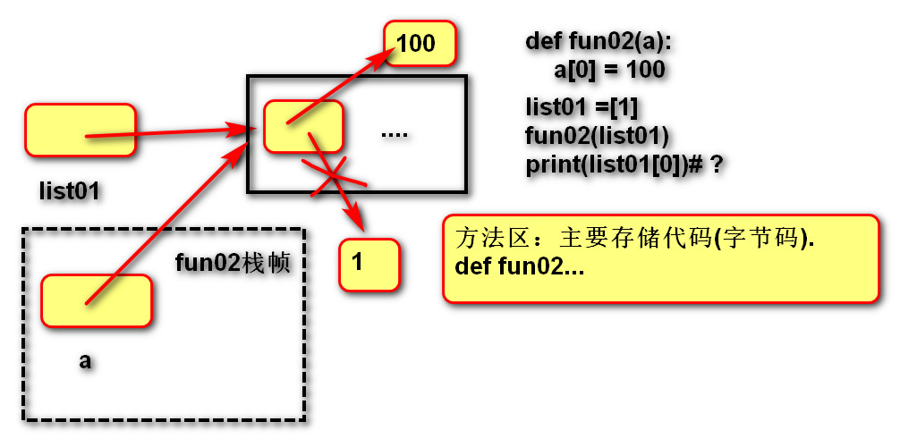
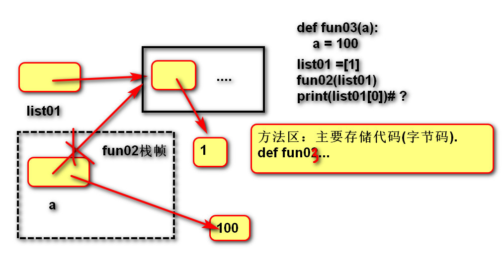

[TOC]
## 函数:

### 1.定义：
用于封装一个特定的功能，表示一个功能或者行为

### 2.作用：
提高代码的可重用性和可维护性

### 3.语法：
```
def 函数名(形式参数):
    函数体

def add(a,b):
    return a+b
```
### 4.返回值 return
函数体没有return时返回None

**可变／不可变类型在传参时的区别**
- 不可变类型参数有:
    >数值型(整数，浮点数,复数)
    布尔值bool
    None 空值
    字符串str
    元组tuple
    固定集合frozenset

- 可变类型参数有:
    >列表 list
    字典 dict
    集合 set

- 传参说明：(可以画内存图理解)
    >不可变类型的数据传参时，函数内部不会改变原数据的值。
    可变类型的数据传参时，函数内部可以改变原数据。

### 5.作用域 LEGB
>(1)定义：变量起作用的范围
(2)Local局部作用域：函数内部。
(3)Enclosing  外部嵌套作用域 ：函数嵌套。 
(4)Global全局作用域：模块(.py文件)内部。 
(5)Builtin内置模块作用域：builtins.py文件

- 变量名的查找规则
    >(1). 由内到外：L -> E -> G -> B
    (2). 在访问变量时，先查找本地变量，然后是包裹此函数外部的函数内部的变量，之后是全局变量，最后是内置变量

### 6.函数参数(实际参数)
```
def fun01(a, b, c, d):
    print(a)
    print(b)
    print(c)
    print(d)
```
>(1).位置实参：实参与形参根据位置进行依次对应.
fun01(1, 2, 3, 4)

>(2).关键字实参:实参与形参根据名称进行对应
fun01(b=1, d=2, c=3, a=4)

>(3).序列实参:星号将序列拆分后按位置与形参进行对应如果参数很多，可以存储在序列(字符串/列表/元组)中,再通过*拆分,直接传入函数.
list01 = ["a","b","c","d"]
fun01(*list01)

>(4).字典实参:双星号将字典拆分后按名称与形参进行对应
    如果参数很多，可以存储在字典中,
　　再通过**拆分,传入函数.
dict01 = {"a": 1, "c": 3, "d": 4, "b": 2}
fun01(**dict01)

### 7.函数参数(形式参数)
>(1).缺省(默认)形参:如果实参不提供，可以使用默认值.
```
def fun01(a=None, b=0, c=0, d=0):
    print(a)
    print(b)
    print(c)
    print(d)
# 关键字实参 + 缺省形参:调用者可以随意传递参数.
fun01(b=2, c=3)
```
>(2).位置形参
```
def fun02(a, b, c, d):
    print(a)
    print(b)
    print(c)
    print(d)
```

>(3).星号元组形参: * 将所有实参合并为一个元组
    作用：让实参个数无限
def fun03(*args):
    print(args)

>(4).命名关键字形参:在星号元组形参以后的位置形参
    目的：要求实参必须使用关键字实参.
```
def fun04(a, *args, b):
    print(a)
    print(args)
    print(b)
fun04(1, b=2)
fun04(1, 2, 3, 4, b=2)
```

>(5).双星号字典形参：**目的是将实参合并为字典.
    实参可以传递数量无限的关键字实参.
```
def fun06(**kwargs):
    print(kwargs)
fun06(a=1, b=2)
```

### 8.函数内存图





