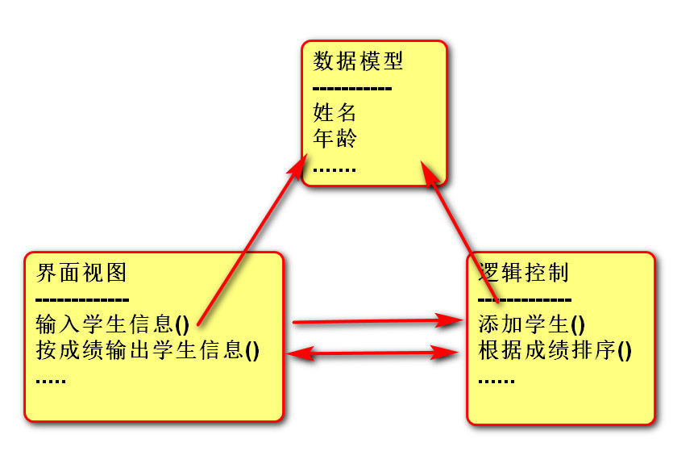

## 三层架构:
    View   Model  Controller
    界面    数据    业务逻辑
    变化    载体     变化

```
class XXController:
    def add_xx(self, a):
        print("Controller 添加了数据", a)


class XXView:
    def __init__(self):
        self.c = XXController()

    def input_xx(self):
        # 需求：调用XXController类中的实例方法add_xx
        self.c.add_xx(100)


v = XXView()
v.input_xx()
```


