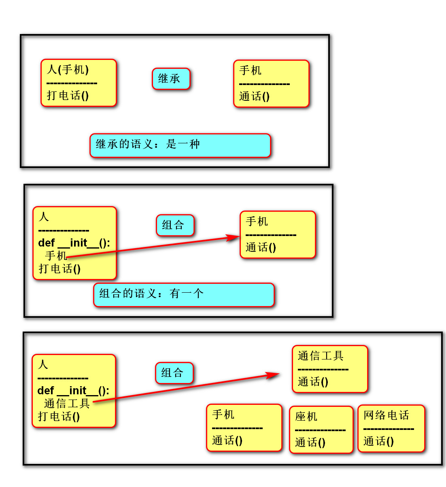

## 面向对象：
    考虑问题从对象的角度出发.
    抽象：从多个事物中，舍弃个别的/非本质的特征(不重要)，
        抽出共性的本质(重要的)过程。

### 三大特征：
    封装：
        数据的角度:将多个变量封装到一个自定义的类中
        功能的角度:对外提供必要的功能,隐藏实现的细节
        设计的角度:
            分而治之:将一个大的需求分解成多个类,每个类只负责一个职责
            变则疏之:遇到变化点就单独封装成一个类
            高类聚:每个类有且只有一个变化的原因
            低耦合:类与类之间的关系松散

        将每个变化点单独分解到不同的类中。
            例如：老张开车去东北
            做法：定义人类，定义车类。

    继承：重用现有类的功能和概念，并在此基础上进行扩展。
           统一概念
        例如：图形管理器，统计圆形/矩形.....面积。
        做法：用图形类代表/约束，圆形/矩形..具有计算面积的方法.

    多态：调用父类的方法，执行子类方法,父类的方法是抽象的,子类的方法是具体的
        重写：覆盖父类那个比较抽象的方法。
        例如：图形管理器调用图形的计算面积方法
             具体图形必须重写图形的计算面积方法。
        继承是共性(计算面积)，多态个性(长*宽 / pi *r**2)。

### 设计原则
    开闭原则：允许增加新功能，不允许修改客户端代码.
    单一职责：一个有且只有一个改变的原因.
    依赖倒置：调用抽象(父)，不要调用具体(子);
            抽象不要依赖具体.
    组合复用：如果仅仅是代码的复用，优先使用组合.
    里氏替换:任何父类出现的地方都可以被子类替换掉
    迪米特法则:指类与类之间在需求满足的条件下,尽量不要有太多的关联

### 类与类关系
    泛化[继承](做成爸爸)
    关联(做成成员变量)
    依赖(做成方法参数)

### 内存图
>图形管理器

>组合复用

>继承内存图

