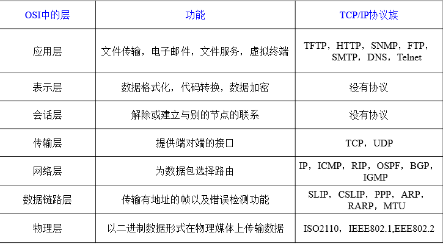
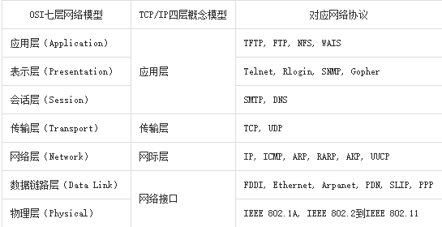

网络编程的基本概念:
### OSI7层模型
作用：使网络通信工作流程标准化

>应用层 ： 提供用户服务，具体功能有应用程序实现
表示层 ： 数据的压缩优化加密
会话层 ： 建立用户级的连接，选择适当的传输服务
传输层 ： 提供传输服务
网络层 ： 路由选择，网络互联
链路层 ： 进行数据交换，控制具体数据的发送
物理层 ： 提供数据传输的硬件保证，网卡接口，传输介质

### TCP/IP模型

作用
**三次握手四次挥手** 过程以及作用 
**tcp udp的理解**
TCP和UDP的区别:
TCP有连接,会产生粘包
UDP没有连接,不会粘包

概念:IP 域名 端口
### TCP:
socket 套接字 流式套接字   数据报套接字
server: 
>scoket >bink() >listen > accept > recv/send > close

client: 
>socket > connect > send/recv > close

粘包 只有在tcp中会粘包,tcp没有消息边界,多次发送内容被一次接收

### UDP
server:
>socket > bind > recvfrom/sendto > close

client:
>socket > sendto/recvfrom > close 

### http 协议
HTTP请求（request）
http响应（response）

### GIL (全局解释器锁)
给解释器加锁,在解释线程时,同一时刻只能解释一个线程.导致python线程效率低

### 进程和线程的区别

### 并发模型
多线程多进程并发
fork
process
thread

### IO 多路复用
select 
优点:支持windows,linux,unix
缺点:效率相对epoll一般,最多监控1024个IO

poll 
优点:支持同时监控更多的IO,支持linux,unix
缺点:效率相对epoll一般

epoll
优点:效率高,有更多的出发方式
缺点:只支持linux

<table>
<tr>
<td>111</td>
<td>111</td>
</tr>
</table>