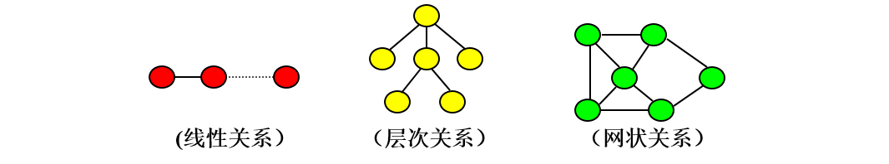

## 数据结构
### 1.概念
    数据结构指的是数据元素及数据元素之间的相互关系，或组织数据的形式

### 数据之间的结构关系
1.逻辑结构
- 逻辑结构分类
>(1).线性结构
    - 集合中必存在唯一的一个"第一个元素"；
    - 集合中必存在唯一的一个"最后的元素"；
    - 除最后元素之外，其它数据元素均有唯一的"后继"；
    - 除第一元素之外，其它数据元素均有唯一的"前驱"。
    - 前后节点之间是1对1的关系

>(2)树形结构
    一个父节点对应多个子节点

>(3)图状结构(网状结构)
    每个节点之间是多对多关系

>(4)其它结构
    除了以上几种常见的逻辑结构外，数据结构中还包含其他的结构，比如集合等。有时根据实际情况抽象的模型不止是简单的某一种，也可能拥有更多的特征。

2.存储结构
- 特点：
是数据的逻辑结构在计算机存储器中的映象（或表示）
- 存储结构分类
(1)顺序存储
顺序存储（Sequential Storage）：将数据结构中各元素按照其逻辑顺序存放于存储器一片连续的存储空间中。
(2)链式存储
链式存储（Linked Storage）：将数据结构中各元素分布到存储器的不同点，用记录下一个结点位置的方式建立它们之间的联系，由此得到的存储结构为链式存储结构。链式存储的数据在内存中是不连续的
(3)索引存储
索引存储（Indexed Storage）：在存储数据的同时，建立一个附加的索引表，即索引存储结构=数据文件+索引表。

3.线性表的存储结构
- 顺序结构
    将线性表中的各元素依次存储于一片连续的存储空间
    
>特点:
(1).逻辑上相邻的元素 ai, ai+1，其存储位置也是相邻的；
(2).存储密度高，方便对数据的遍历查找。
(3).对表的插入和删除等运算的效率较差。

列表就是顺序存储
- 链式结构
    将线性表L=(a0,a1,……,an-1)中各元素分布在存储器的不同存储块，称为结点，每个结点（尾节点除外）中都持有一个指向下一个节点的引用，这样所得到的存储结构为链表结构

>特点:
(1)逻辑上相邻的元素 ai, ai+1，其存储位置也不一定相邻；
(2)存储稀疏，不必开辟整块存储空间。
(3)对表的插入和删除等运算的效率较高。
(4)逻辑结构复杂，不利于遍历。

4.栈
>特点:
(1)先进后出,或者后进先出
(2)只有尾部可以入栈
(3)只有尾部可以出栈

5.队列
>特点:
(1)先进先出,或者后进后出
(2)只有队尾可以入队
(3)只有队头可以出队

6.树形结构
- 基本概念:
(1)定义:
>树（Tree）是n（n≥0）个节点的有限集合T，它满足两个条件：有且仅有一个特定的称为根（Root）的节点；其余的节点可以分为m（m≥0）个互不相交的有限集合T1、T2、……、Tm，其中每一个集合又是一棵树，并称为其根的子树（Subtree）。

(2)度数
>一个节点的子树的个数称为该节点的度数，一棵树的度数是指该树中节点的最大度数。

递归(笔试题):
1.递归是一种算法
2.函数(方法)自己调用自己
3.递归有2个要素
(1)递推(找规律)
(2)回归(找出口)
4.耗内存
例子:
(1)斐波拉切数列
1 1 2 3 5 8 13 21
(2)求阶乘
